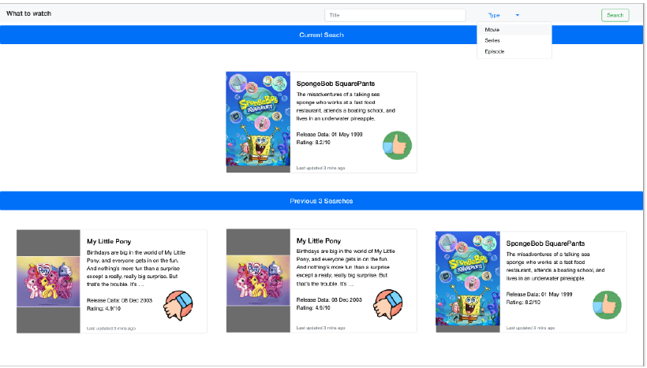

# What To Watch

## The Goal

Create a simple React application that given a movie title ,and type will return the movie information from Open Movie Database. It will also keep the last 3 searches in memory.

### Example
When given the title symbol `SpongeBob` your application would use the open movie database
to return the summary of the show , it's release date, and ranking. If the ranking is above a 5
display a thumbs up, if its below a 5 display a thumbs down.

## Requirements

The application should connect to the Open Movie Database

(https://www.omdbapi.com/?apikey=[key]&t=my%20little%20pony&type=series)

You will need a api key that will be provided to you at the begining of the assignment.
The application should consiste of the following components:

* A Header with a text input to enter the title, and optionally type.
* A Container component for holding most 3 movie cards with a title bar that can change
based off the props being set.
* A Card component that contains the movie data.

The card should have a Image, Text, and Thumbs Up/Down
The app should have 2 instances of the Container component, one for the Current, and for the
Previous.

## Notes

No need to store the votes in any kind of back-end, storing them in session is fine for this
challenge
You may use any libraries you think you'll need to complete the task